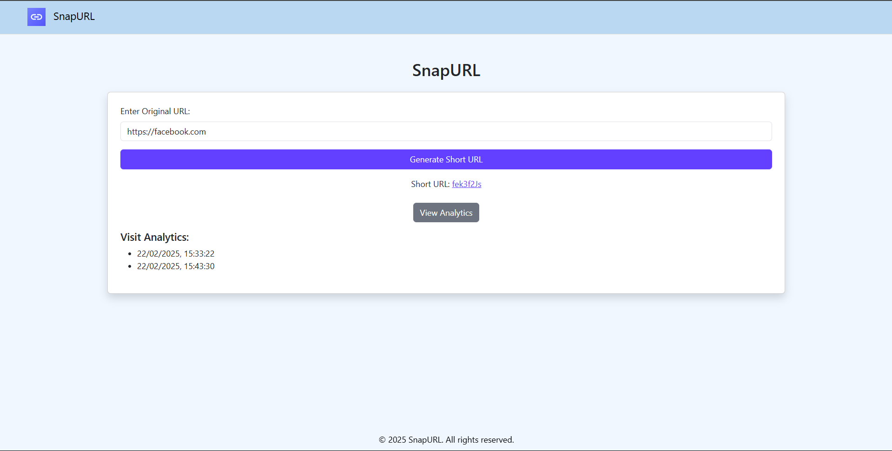

# SnapURL 🚀  
**A simple and efficient URL shortener to convert long links into clean, compact URLs.**  

## ✨ Features  
✅ Fast and easy link shortening  
✅ Minimal and user-friendly interface  
✅ Lightweight and efficient  

## 🛠 Tech Stack  
- **Frontend:** (React, Tailwind CSS)  
- **Backend:** (Node.js, Express.js)  
- **Database:** (MongoDB)  

  

